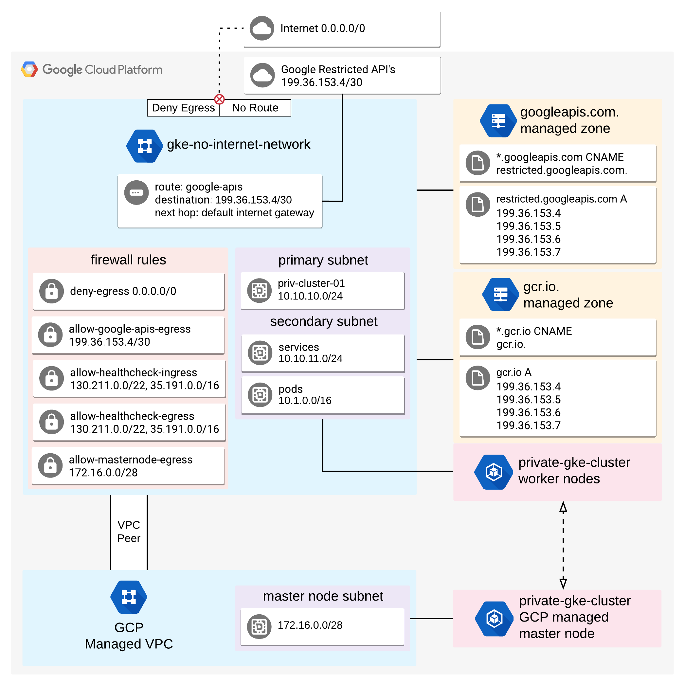

# Completely Private GKE Clusters with No Internet Connectivity

This is a terraform config to deploy a completely private GKE cluster
with no accses to the internet. It is an accompaniment to the following 
[medium post](https://medium.com/@andreyk_/945fffae1ccd). The post goes into 
more detail about the configuration behind these files.

## Variables
There is a "variables.tfvars" file in the top level directory of the repo.
Update this file to reflect your environment before running the deploy script
or applying the terraform files.

The project ID in this file is commented out. This is to enable running the deploy script without 
the project ID value populated. Uncommenting and adding the ID value will run terraform without any prompts, 
otherwise project ID will need to be entered during the terraform apply.

## Deploy

To quickly deploy the terraform config files, there is a script available
in the top directory called "deploy.sh". 

```
git clone https://github.com/andreyk-code/no-inet-gke-cluster.git
cd no-inet-gke-cluster
./deploy.sh
```

If not using the deploy script, apply the various terraform main.tf files in this order:

```
network
firewall-rules
DNS
priv-cluster
```

## The Environment




## GCP Modules  

The terraform files for the VPC and the GKE cluster are using the following [Google maintained modules](https://github.com/terraform-google-modules). 


## Terraform version
Tested with Terraform v0.11.*. Incompatible with Terraform 0.12.
